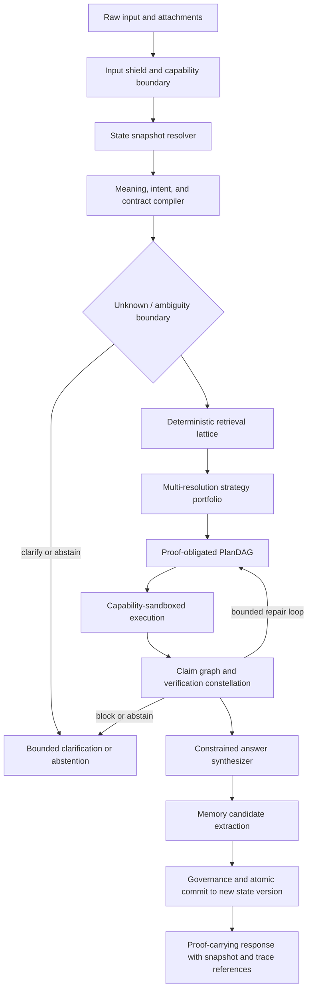

# AXIMA Master Plan — The Zero-Parameter Verification Engine

**Plan version:** 2.0
**Date:** 2026-07-24
**Status:** Proposed authoritative engineering plan. **Supersedes** `AXIMA_PHASE_11_ULTRA_COSMIC_MASTER_PLAN.md` and `COSMIC_CHAT_AND_LOGIC_PLAN.md` (both merged into this document).
**Scope:** Documentation and future-work definition. This document does not itself change runtime behavior.
**Strategy:** Evolve the current Python architecture; do not rewrite it.
**North star:** Be the deterministic, verification-first cognitive engine that produces provably correct, reproducible, auditable answers at zero learned parameters — and beat frontier AIs on the tasks where correctness can be checked.

---

## How to read this document

- **Section 0** explains the whole plan in plain language. If you read nothing else, read it.
- **Sections 1–3** are the rules and the honest starting point.
- **Sections 4–9** are the architecture.
- **Section 10** is the heart: exactly how we go after GSM8K, MATH, SWE-bench, and the hallucination/reproducibility suites.
- **Sections 11–18** are domains, resources, security, evaluation, the competitive scorecard, the chat experience, and migration.
- **Sections 19–26** are research boundaries, the near-term backlog, risks, rejected claims, ADRs, definition of done, and the evidence appendix.

### Table of contents

0. Executive overview (explain-first)
1. Constitutional invariants
2. Operating definitions
3. Evidence-grounded baseline and critical gaps
4. The cognitive transaction kernel
5. Canonical contracts
6. Persistent, executable, governed memory
7. Reasoning, proof-obligated planning, and safe execution
8. Verification as the mandatory release gate
9. Constrained answer synthesis
10. Benchmark-domination tracks — the Zero-Parameter Attack Stack
11. Domain capability tracks
12. The 50 MiB resource architecture
13. Security, privacy, and governance
14. Observability and operations
15. Evaluation science
16. Head-to-head cosmic scorecard
17. Conversational experience layer
18. Incremental migration and compatibility
19. Bounded research annex
20. Near-term execution backlog
21. Risk register
22. Rejected and quarantined claims
23. Required ADRs
24. Definition of done
25. Evidence appendix
26. Supersedes note

---

## 0. Executive overview (explain-first)

### 0.1 What AXIMA is

AXIMA is a **cognitive engine with zero learned parameters**. There are no neural network weights, no pretrained embeddings, and no calls to any external language model — not GPT, not Claude, not Gemini, not any local model. Everything AXIMA does is explicit: parsers, grammars, exact mathematical algorithms, curated facts and rules, deterministic retrieval, and independent verifiers. Because there is nothing learned and nothing hidden, every answer can be traced, checked, and reproduced exactly.

This is the opposite of how GPT, Claude, and Gemini work. Those are enormous trained networks. They are broad and fluent, but they have four permanent weaknesses that come from being probabilistic learned systems:

1. **They hallucinate** — they state false things with full confidence.
2. **They cannot prove anything** — they cannot hand you a checkable derivation of why an answer is correct.
3. **They cannot reproduce** — the same question can produce different answers, and there is no way to replay exactly how an answer was produced.
4. **They cannot update cleanly** — fixing a fact means expensive retraining, not a surgical, reversible change.

AXIMA is built to exploit exactly those four weaknesses.

### 0.2 The core insight

> We do not win by knowing more than a trillion-parameter model. We cannot; you cannot compress the world's text into a tiny deterministic engine. We win by being **right on purpose, provably, and reproducibly** — and by refusing to guess when we cannot verify.

Every answer AXIMA releases is a **proof-carrying artifact**: it is compiled from a stated request and an immutable snapshot of what AXIMA knew, produced by an explicit plan, and checked by independent verifiers before release. If the verifiers cannot confirm a claim, AXIMA **abstains or clearly labels the claim as unverified** rather than fabricating. That single discipline is what a probabilistic model structurally cannot offer.

### 0.3 How "beating GPT / Claude / Gemini" is defined here

"Beat them" is only meaningful if it is measurable. This plan commits to a specific, honest definition:

- **Win outright, now, on the axes where checking is possible:** hallucination rate, reproducibility, exact-and-verified mathematics, citation precision, and cost/memory per correct answer. On a reproducibility suite and a hallucination suite, a deterministic verification-first engine is expected to dominate — there is no probabilistic competitor on those axes.
- **On GSM8K, MATH, and SWE-bench, hold a near-100% precision floor and climb coverage.** AXIMA answers only what it can verify, so the answers it *does* give are correct at a rate a probabilistic model cannot match. The fraction of problems it can attempt ("coverage") starts smaller and is raised, honestly and measurably, by a governed coverage-growth loop.
- **What we explicitly do not claim:** we do not claim to beat frontier models at open-domain chat, general world knowledge, or creative writing. A zero-parameter engine will not match their breadth there, and pretending otherwise would violate the honesty rules below. Those tasks are listed as *not contested* in the scorecard (Section 16).

So the honest headline is: **AXIMA does not try to be a bigger brain. It is the engine that makes every answer provably correct and reproducible, and it grows the set of problems it can prove.** Raw-accuracy parity with a 95%-scoring model on the full breadth of these benchmarks is an engineered, climbing target — a moonshot pursued with a guaranteed precision floor — not a switch we can flip on day one. This document never presents it as certain.

### 0.4 How AXIMA gets there — the attack stack

The techniques that produce the wins are collected in Section 10 as the **Zero-Parameter Attack Stack** (A–H):

- **A. Deterministic semantic parser** — turn a natural-language problem into a formal system of equations/constraints. This is the real bottleneck for GSM8K; the arithmetic was never the hard part, the language is.
- **B. Parse portfolio + verified self-consistency** — generate several candidate formalizations, solve each exactly, and select by agreement plus constraint re-checking. A verified analog of the "self-consistency" trick, but checked rather than voted.
- **C. Exact computer-algebra core + strategy portfolio** — exact rationals, algebra, number theory, geometry, calculus, plus a per-problem-class strategy selector and counterexample search. The MATH engine, returning proven answers.
- **D. Proof-carrying answers + back-substitution verifier** — re-check every answer against all stated constraints and ship a checkable derivation. Precision by construction.
- **E. Spec-driven program repair** — for SWE-bench, localize the fault from failing tests, synthesize a candidate patch from templates/constraints, and run the repo's real test suite; submit only patches that pass. Test-gated means correct-by-construction on the slice we can reach.
- **F. Calibrated abstention gate** — never fabricate; abstain when parse or verification confidence is low. This converts limited coverage into a reliability advantage and dominates the hallucination suite.
- **G. Governed coverage-growth loop** — widen the parser, strategy, and repair-template coverage systematically, measured on frozen sets and holdout-tested against overfitting and contamination. This is the honest engine that raises raw accuracy over time.
- **H. Reproducibility by snapshot** — every run is replayable byte-for-byte, owning the reproducibility suite.

### 0.5 What this plan preserves and what it fixes

AXIMA already exists as a substantial Python system (Section 3 and the Evidence Appendix quantify it precisely). The problem is not missing components — it is that the strongest components are **built but not connected to the live answer path**. The planner is created and never called; the verification result is computed and then thrown away; memory growth is guarded by a check that never triggers; the knowledge fallback is a tiny hardcoded table disconnected from a ~146 MB corpus. This plan's near-term backlog (Section 20) reconnects these, in order, test-first — turning existing capability into live capability before anything new is built.

### 0.6 The covenant

AXIMA's advantage is not sounding omniscient. It is knowing exactly what it was asked, which state of knowledge it used, what it retrieved, what it assumed, what plan it ran, which checks passed or failed, what remains unknown, and how to reproduce or revoke the result. **Build the blade, measure the edge, and never call it a crown until independent evidence proves the domain victory.**

---

## 1. Constitutional invariants

These override feature pressure, benchmark pressure, and schedule pressure. A change that violates an invariant is rejected regardless of how good its numbers look.

1. **Zero learned parameters.** The runtime contains no trained neural weights, no pretrained embeddings, no hidden model calls, and no remote LLM dependency — not even as an optional plugin. This is absolute.
2. **Determinism by snapshot.** Given the same normalized request, immutable state snapshot, configuration, tool versions, and budget, AXIMA produces the same semantic result and decision trace.
3. **Verification before release.** A claim that requires verification cannot be released at a stronger truth level than its completed verifier receipts allow.
4. **Retrieval before synthesis.** Facts, rules, prior skills, failure cases, and proof artifacts are retrieved before an answer is composed.
5. **Planning before side effects.** No state-changing operation runs without a validated plan node, authorization, budget, and rollback policy.
6. **No generator self-grading.** A component that produces a claim may not be the authority that verifies it. Verifier independence is enforced.
7. **Canonical memory is earned.** Raw conversations, unverified outputs, and successful-looking traces do not become canonical knowledge automatically.
8. **Uncertainty is conserved.** Rendering, aggregation, and repeated agreement among correlated sources may not increase confidence without new independent evidence.
9. **Abstention is success when warranted.** Unsupported, ambiguous, stale, or unverifiable requests produce bounded clarification or abstention, not confident fabrication.
10. **Backward compatibility by default.** Public contracts evolve additively; replacements reach feature and test parity before legacy paths are retired.
11. **Resource budgets are executable.** Time, steps, recursion, disk I/O, trace size, cache size, and resident memory are enforced, not merely documented.
12. **Governance cannot self-weaken.** AXIMA cannot grant itself capabilities, alter its approval policy, erase audit history, or promote its own unreviewed changes.
13. **Every module has measurable value.** A module without a benchmark, a resource budget, a failure policy, and an integration path stays experimental.
14. **No benchmark theatre.** Expected outputs are never edited to match current behavior. Small, visible public suites cannot justify frontier-level claims.
15. **No unbounded cognition.** Infinite logic, unrestricted recursion, unlimited graph expansion, and unconstrained self-modification are prohibited in the production runtime.
16. **The honesty gate (new).** No claim — in an answer, a benchmark report, the README, or this plan — may exceed the evidence that backs it. Coverage and abstention are always reported alongside accuracy. Superiority is claimed only per named task with reproducible receipts.
17. **Measure-then-bind (new).** Every numeric target in this document is provisional until a baseline measurement validates both the metric and the sample power. Targets are goals to measure against, not promises already kept.

---

## 2. Operating definitions

### 2.1 Zero learned parameters

**Permitted:** deterministic parsers, grammars, finite-state machines, rewrite systems, decision tables; exact numerical and symbolic algorithms; curated facts, definitions, rules, theorems, templates; lexical indices and BM25/TF-IDF statistics computed from local corpora; non-learned hashes, fingerprints, and sparse signatures; rules or skills extracted from verified traces under governance; local compilers, provers, SAT/SMT tools, and test runners declared as optional tools; user-supplied data with explicit provenance.

**Prohibited:** trained neural weights of any size; pretrained embeddings; external LLM/API calls (hidden or explicit); model-generated rules promoted without independent tests and governance; undeclared online services that influence answers; probabilistic outputs whose seed and algorithm are not captured by the snapshot.

### 2.2 Determinism

"Same input, same output forever" is not the definition, because legitimate knowledge updates must be possible. The binding definition is functional over an immutable snapshot:

```text
semantic_result = F(
    normalized_task,
    state_snapshot_id,
    runtime_version,
    configuration_hash,
    declared_tool_versions,
    resource_budget,
    platform_contract
)
```

A learning event creates a **new immutable state version**. Replaying against the old snapshot reproduces the old result; replaying against the new snapshot may produce an improved result, and the transition is auditable. Wall-clock time, random UUIDs, and process IDs are nondeterministic metadata and must not affect semantic hashes or routing.

### 2.3 The 50 MiB runtime envelope

The reference profile must operate under **50 MiB peak process resident set size (RSS)**, not merely Python heap size. The gate includes the interpreter and loaded shared libraries attributable to the process, imported AXIMA modules, active plugin state, working/session memory, retrieval indices resident in RSS, caches, buffers, traces, verifier state, and one active request. It excludes OS memory outside the process, nonresident corpus files on disk, and optional external tools running as separately budgeted processes. The claim is valid only on platforms that pass the same workload and measurement protocol (Section 12).

### 2.4 Intelligence as a vector

AXIMA does not report one intelligence score. It reports a vector: supported coverage, verified correctness, proof strength, retrieval quality, plan success, recovery success, abstention calibration, memory-reuse gain, determinism, latency, memory cost, and audit completeness. A release may improve one dimension only if it does not silently regress a constitutional dimension.

---

## 3. Evidence-grounded baseline and critical gaps

This plan begins from the repository as audited on 2026-07-24. Exact file/line evidence is in Section 25.

### 3.1 Observed assets (machine-inventoried; measure-then-bind)

- **118** Python files under `src/axima/` (208 across all of `src/`).
- **795** explicit `test_*` function definitions across **20** test files under `tests/`.
- **9** plugin packages: `brain`, `coder`, `creator`, `document`, `inference`, `math`, `multimodal`, `physics`, `web`.
- Approximately **146 MB** of corpus data under `data/`: `axima.cse` (70 MB), `axima_hot.cse` (19 MB), `axima_cold.cse.gz` (23 MB), `all_triples_clean.txt.gz` (34 MB).
- Substantial existing subsystems: planning (`planner.py`, `plan_dag.py`, `transaction.py`), memory (`four_plane.py`, `recall.py`), verification (`constellation.py`, `math_verifier.py`, `code_verifier.py`, `provenance_verifier.py`, `counterfactual.py`, `metamorphic.py`, `confidence.py`), evidence (`claims.py`, `derivation.py`, `provenance.py`, `reality_ledger.py`, `contradiction.py`), cognition (`reasoning_tournament.py`, `skill_foundry.py`, `learning_loop.py`, `governance.py`, `experiment.py`, `prediction.py`), specialists (math/physics/causal/knowledge/document), benchmarks (`manifest.py`, `judges.py`, `immune_system.py`, `runner.py`, `comparison.py`), production (`lifecycle.py`, `backup.py`, `api.py`), agency, security, and observability.

These counts must be regenerated by a machine inventory before any release; they are recorded here as the audited baseline, not as permanent truth.

### 3.2 Foundations to preserve

| Existing foundation | Role in this plan |
|---|---|
| `Axima` public API (`api.py`) | Stable compatibility boundary and cognitive-transaction entry point |
| `MeaningIR` / `MeaningCompiler` | Base semantic representation; extend, do not replace |
| `EpistemicContract` / `ContractCompiler` | Answer-by-contract mechanism |
| `IntentLattice` / `IntentDetector` | Multi-candidate routing layer |
| `PlanDAG` / `CognitivePlanner` | Planning graph and planner contracts |
| plugin loader and registry | Domain execution boundary |
| `FourPlaneMemory` | Compatibility facade over tiered memory |
| `KnowledgeIndex` (`knowledge/index.py`) | Typed subject/relation/object retrieval |
| `RealityLedger`, claims, derivation, provenance | Truth-maintenance and evidence foundations |
| `VerificationConstellation` and domain verifiers | Independent claim-verification foundations |
| `SkillFoundry`, `learning_loop`, `governance` | Governed learning foundations |
| benchmarks, judges, immune system | Evaluation and contamination-control foundations |

### 3.3 Critical gaps this plan must close (each verified; see Section 25)

1. **The planner is never invoked.** `CognitivePlanner` is imported and instantiated in `api.py`, but `query()` never calls `self._planner.plan(...)`. The documented planning stage is absent from the live path.
2. **Verification is computed and discarded.** `_verify()` performs only two trivial non-empty checks, and even that result is dropped because `_build_response` hard-codes `verification=None`. The real `VerificationConstellation` is not the release gate.
3. **The verifier constellation ships empty.** `VerificationConstellation` starts with zero registered verifiers, so wiring it into the live path requires also registering the existing domain verifiers.
4. **The episodic-memory bound never triggers.** `EpisodicMemory` stores entries in `self._episodes`, but `api.py` guards growth by checking `self._memory._episodic._entries` — an attribute that exists only on `SemanticMemory`. The `hasattr` check is always false, so the intended 500-entry bound is never applied.
5. **The knowledge fallback is disconnected.** It is a small hardcoded dictionary in `api.py`, unrelated to the ~146 MB on-disk corpus and the `KnowledgeIndex`.
6. **Confidence is heuristic.** It is derived from engine names, not from claim-level evidence and verifier coverage.
7. **No durable, versioned memory.** Memory is volatile and process-local, lacking checksums, verification state, version lineage, and durable persistence.

### 3.4 Explicit non-goals

No ground-up rewrite; no renaming modules to resemble a diagram; no replacing stable public APIs without adapters; no neural or remote model component ever; no self-deployment or unrestricted self-modification; no claim of general intelligence from architecture alone; no open-domain-chat parity claim.

---

## 4. The cognitive transaction kernel

Every request becomes an atomic, replayable cognitive transaction. The current `Axima.query` path and the microkernel path converge onto this single authoritative loop.



### 4.1 Transaction properties

Atomicity (canonical memory changes commit together or not at all); consistency (schema, graph, proof, and policy invariants hold before and after); isolation (concurrent sessions never observe partially promoted memory); durability (approved commits survive restart with checksummed persistence); replayability (inputs plus immutable references reconstruct the decision path); budgetability (every expansion consumes explicit resources); reversibility (promoted rules and skills can be revoked without deleting audit history).

### 4.2 Architectural planes

Four planes plus two cross-cutting planes: **meaning** (parsing, normalization, ambiguity, semantic hashes); **control** (routing, planning, scheduling, execution, recovery, budgets); **evidence** (claims, provenance, derivations, verification, confidence); **expression** (constrained rendering, explanation, output schemas); **memory** (cross-cutting: retrieval, state versions, compaction, promotion, truth maintenance); **governance** (cross-cutting: capability policy, approvals, audit, risk, lifecycle). Memory and governance constrain every stage; they are not final steps.

### 4.3 Incremental module map

Extend current packages; do not create a competing architecture. A new module is added only after an ADR states its responsibility, boundary, benchmark, memory budget, failure behavior, migration path, and owner.

| Area | Preserve | Candidate additions |
|---|---|---|
| Contracts | `contracts/query.py` | `contracts/cognitive.py`, `contracts/state.py`, migrations |
| Kernel | `kernel/runtime.py`, scheduler, registry | `kernel/cognitive_loop.py`, `kernel/state_snapshot.py`, `kernel/budget_governor.py` |
| Semantics | `MeaningIR`, compiler, checksum | task normalization, semantic-compression IR, ambiguity policy |
| Planning | planner, PlanDAG, transactions | typed obligations, deterministic scoring, repair executor |
| Memory | four-plane facade, recall | schema, SQLite store, executable DSL, compactor, promotion pipeline |
| Knowledge | corpus, index, crystals | retrieval lattice, ranking, dependency graph |
| Verification | constellation, domain verifiers | mandatory release gate, coverage policy, receipt store |
| Responses | proof-carrying response | constrained synthesizer, round-trip checker |

---

## 5. Canonical contracts

All contracts are schema-versioned, additive where practical, deterministically serialized, and content-addressed. Names describe target semantics; exact Python APIs are finalized through ADRs and contract tests.

### 5.1 CognitiveTaskEnvelope

```json
{
  "schema_version": 1,
  "task_id": "content-addressed-or-transaction-id",
  "input_text": "Solve x^2 - 5x + 6 = 0",
  "normalized_input_hash": "sha256:...",
  "state_snapshot_id": "state:sha256:...",
  "domain_candidates": ["mathematics"],
  "constraints": {"exact_only": true, "show_steps": true, "max_depth": 12},
  "risk_profile": {"class": "normal", "impact": "low", "freshness_required": false},
  "budget": {"wall_time_ms": 1200, "rss_limit_mib": 50, "max_steps": 100, "max_retrieval_candidates": 128, "max_trace_bytes": 65536},
  "output_contract": {"schema": "structured_answer.v1", "truth_floor": "derived", "include_trace_summary": true}
}
```

### 5.2 StateSnapshot

```json
{
  "snapshot_id": "state:sha256:...",
  "parent_snapshot_id": "state:sha256:...",
  "runtime_version": "...",
  "code_revision": "git:...",
  "config_hash": "sha256:...",
  "rule_pack_roots": ["sha256:..."],
  "knowledge_root": "sha256:...",
  "memory_root": "sha256:...",
  "governance_policy_hash": "sha256:...",
  "tool_manifest_hash": "sha256:...",
  "numeric_policy": "exact-first-v1",
  "created_by_transaction": "txn:..."
}
```

The snapshot captures all semantic influences. It excludes volatile latency, wall-clock display time, and process-local IDs.

### 5.3 PlanNode

```json
{
  "node_id": "plan-node:sha256:...",
  "op": "classify|clarify|retrieve|derive|compute|execute|validate|verify|repair|synthesize|commit",
  "capability": "math.exact_algebra.v2",
  "input_refs": ["artifact:..."],
  "output_types": ["claim_set.v1"],
  "preconditions": ["expression.parsed", "domain.nonzero_denominator"],
  "postconditions": ["candidate_roots.produced"],
  "proof_obligations": ["roots.substitute_to_true", "domain.constraints_preserved"],
  "dependencies": ["node:..."],
  "fallback_nodes": ["node:..."],
  "side_effect_class": "none",
  "estimated_cost": {"time_ms": 20, "memory_kib": 64, "steps": 4},
  "deterministic": true,
  "tie_break_key": "stable-content-hash"
}
```

### 5.4 Claim, EvidenceItem, VerificationReceipt

```json
{
  "claim_id": "claim:sha256:...",
  "statement_ir": {"predicate": "equals", "arguments": ["x", 2]},
  "rendered_statement": "x = 2 is a solution",
  "claim_type": "derived",
  "scope": "under declared equation domain",
  "assumptions": [],
  "evidence_refs": ["evidence:..."],
  "derivation_ref": "derivation:...",
  "generator": "math.exact_algebra.v2",
  "risk_class": "normal"
}
```

```json
{
  "evidence_id": "evidence:sha256:...",
  "source_type": "curated|user|tool|derived|formal",
  "content_hash": "sha256:...",
  "valid_time": [null, null],
  "transaction_time": 184000,
  "trust_tier": "T0|T1|T2|T3|T4",
  "independence_group": "math-substitution-verifier",
  "status": "candidate|verified|rejected|revoked"
}
```

```json
{
  "receipt_id": "receipt:sha256:...",
  "claim_id": "claim:sha256:...",
  "verifier": "math.substitution.v2",
  "verifier_version": "2.0.0",
  "independence_group": "substitution",
  "result": "pass|warn|fail|not_applicable",
  "counterexample_refs": [],
  "coverage": ["equation-satisfaction", "domain"],
  "resource_cost": {"time_ms": 2, "memory_kib": 12},
  "receipt_hash": "sha256:..."
}
```

### 5.5 Compatibility rules

New fields are optional with deterministic defaults until a major schema transition. Readers reject unknown required semantics but preserve unknown optional fields on round-trip. Migrations are pure, versioned, and tested against golden fixtures. No mutable Python object identity appears in serialization. Dictionary ordering, float rendering, Unicode normalization, and line endings use canonical policies.

---

## 6. Persistent, executable, governed memory

Memory moves from volatile process-local storage to a versioned knowledge substrate. `FourPlaneMemory` remains the compatibility facade while durable storage and retrieval move behind it. (This section merges what were three overlapping memory sections in the prior plan into one.)

### 6.1 Memory tiers

| Tier | Purpose | Residency |
|---|---|---|
| T0 Working buffer | Current task, goals, top-k records, live plan, verification state | RAM only; hard bounded; cleared at transaction end |
| T1 Session state | Approved continuity, recent task state, unresolved clarifications | Mostly disk; tiny hot window; TTL and sensitivity enforced |
| T2 Semantic store | Verified facts, definitions, relations, compressed structures | SQLite/packs on disk; bounded index pages in RAM |
| T3 Procedural store | Verified strategies, RuleIR, SkillIR, templates, recovery recipes | Versioned immutable packages; lazy-loaded |
| T4 Proof/invariant store | Proofs, invariants, verifier artifacts, counterexamples | Content-addressed, append-only, strongest promotion gate |
| T5 Episodic audit | Outcomes, rejected candidates, failures, corrections | Append-only and compacted; sensitive payloads minimized |

The public four-plane vocabulary remains valid; T4 and T5 are specialized physical stores exposed through the evidence and episodic interfaces.

### 6.2 Canonical MemoryRecord (required corrections)

A record carries: schema version, memory id, record version and parent versions, tier, kind, canonical key, summary, payload reference, symbol/type/relation keys, preconditions, postconditions, failure modes, provenance and evidence refs, dependency refs, contradiction refs, verification state (`quarantined|candidate|verified|canonical|revoked`), verifier receipts, confidence interval, valid time, transaction sequence, retention, sensitivity, content hash, created-in-snapshot, and superseded-by.

Required corrections to today's model: preserve created/expiry and version lineage on import/export; checksum every record and pack; attach verification state, confidence, provenance, and dependency IDs; distinguish transaction time from valid time; represent deletion as a tombstone, not silent erasure; enforce sensitivity at read time; **cap every in-memory collection with deterministic eviction** (directly fixing the episodic-bound bug in Section 3.3); reject tampered or schema-incompatible imports before they affect retrieval.

### 6.3 Executable memory: RuleIR and SkillIR

Executable memory does **not** store arbitrary Python. It stores a small declarative DSL interpreted by a capability-restricted engine.

RuleIR vocabulary: `MATCH`, `REQUIRE`, `BIND`, `LOOKUP`, `TRANSFORM`, `DERIVE`, `COMPUTE`, `ASSERT_POSTCONDITION`, `EMIT`, `FAIL`.

```json
{
  "skill_id": "skill:sha256:...",
  "name": "solve_factorable_quadratic",
  "version": 4,
  "input_types": ["math.polynomial.degree2"],
  "output_types": ["math.solution_set"],
  "program": [
    ["REQUIRE", "leading_coefficient != 0"],
    ["TRANSFORM", "normalize_polynomial", ["input"]],
    ["COMPUTE", "factor_integer_polynomial", ["normalized"]],
    ["ASSERT_POSTCONDITION", "all_roots_substitute_true"],
    ["EMIT", "solution_set"]
  ],
  "proof_obligations": ["normalization_equivalent", "roots_complete", "domain_preserved"],
  "resource_bound": {"max_steps": 40, "max_memory_kib": 256},
  "test_manifest_ref": "tests:sha256:...",
  "approval_ref": "approval:...",
  "status": "candidate|canary|active|revoked"
}
```

DSL safety: no file, network, shell, reflection, import, or dynamic-attribute opcodes; no unbounded loops or recursion; operators registered by immutable ID and version; typed inputs/outputs checked at each step; static maximum step/depth/memory/output bounds; deterministic iteration; interpreter and verifier maintained independently; skill pack hash included in the snapshot.

### 6.4 Governed promotion pipeline

No memory becomes executable or canonical because a query succeeded once.

```text
Observed transaction -> privacy/sensitivity filter -> reusable-pattern detector
  -> anti-unification across diverse traces -> candidate RuleIR/SkillIR
  -> static schema and safety checks -> positive tests -> negative tests
  -> adversarial tests -> metamorphic tests -> held-out domain tests
  -> independent verifier receipts -> governance approval -> canary activation
  -> monitored utility and regression checks -> canonical promotion or revocation
```

Mandatory gates include: at least three structurally diverse source traces; no secrets/private payloads/benchmark answers embedded; explicit pre/postconditions, failure modes, side-effect class, and resource bound; positive/negative/adversarial/metamorphic/holdout coverage; zero critical security findings; improvement over baseline on a frozen set; no significant regression on unrelated frozen suites; governance approval; reversible activation; automatic revocation when monitored postconditions fail.

### 6.5 Durable storage (reference stack)

Standard-library-first: SQLite for transactions, typed metadata, temporal records, and indices; SQLite FTS5 when available with a deterministic lexical fallback; compressed immutable payload packs; content hashes for dedup and integrity; append-only event/approval/revocation logs; lazy hot-index snapshots; **no requirement to load the ~146 MB corpus into RAM**. An atomic commit protocol writes and fsyncs a payload pack, verifies its checksum, inserts records/receipts/audit events inside one SQLite transaction, builds a Merkle-style root, runs invariants, commits, and only then switches the active-snapshot pointer; failure rolls back and deletes orphan packs.

### 6.6 Deterministic retrieval lattice

Retrieval is a typed candidate-and-rank pipeline, not one substring scan and not an opaque vector call. Channels: exact canonical-key; lexical/FTS; symbol/normalized-token; type-compatible; relation/graph-neighborhood; temporal-validity; provenance/trust-tier; dependency/proof-premise; procedural-precondition; failure/counterexample; session-state (when permitted); prior-plan/recovery. Ranking uses fixed-point integer features (lexical relevance, structural match, type compatibility, evidence strength, provenance quality, precondition match, temporal validity, verified usefulness, minus contradiction risk, staleness, duplication, load cost) with stable tie-breaking (score, verification state, trust tier, kind, content hash, record ID). Correctness gates: no unauthorized sensitivity tier enters candidates; no revoked or temporally invalid fact is returned as current; top-k is hard-bounded; correlated copies do not masquerade as independent sources; a cache hit reproduces the same ordered record IDs as fresh retrieval.

---

## 7. Reasoning, proof-obligated planning, and safe execution

### 7.1 Multi-resolution reasoning

AXIMA reasons at several resolutions so it can reject bad strategies before spending resources: **R0 Contract** (what must be answered/proven/avoided/formatted), **R1 Strategy** (which family of methods), **R2 Skeleton** (subgoals, dependencies, proof obligations), **R3 Exact execution** (transformations, computations, tool actions), **R4 Audit** (independent checks). A coarse-level failure blocks finer execution; a fine-level failure triggers bounded local repair or a strategy switch without rebuilding unrelated work.

The strategy portfolio is explicit: direct lookup; exact deduction; algebraic rewrite/normalization; constraint propagation and finite search; case split and bounded enumeration; proof by contradiction; induction over declared schemas; counterexample search; causal intervention over structural models; temporal/bitemporal reasoning; analogy (candidate generation only); abductive hypothesis generation with explicit alternatives; deterministic simulation; tool-backed calculation/compilation/testing; clarification or abstention. Analogy, induction from examples, and heuristic search may *propose* candidates but cannot confer `PROVEN` or `DIRECT_FACT` status without independent evidence.

Cyclic knowledge is allowed only under an explicit fixed-point policy: a cyclic operator must be proven monotone over a finite lattice or carry a declared convergence bound; otherwise the cycle is quarantined. Infinitary or transfinite computation has no place in a bounded production request path (see Section 19).

### 7.2 Proof-obligated planning

The existing `CognitivePlanner`/`PlanDAG` become active in the public transaction (closing gap 3.3.1). Production plans use a small fixed node vocabulary — `classify`, `clarify`, `retrieve`, `derive`, `compute`, `execute`, `validate`, `verify`, `repair`, `synthesize`, `commit` — with domain behavior in capabilities and typed operator IDs, not an unbounded set of orchestration nodes.

Planning algorithm: normalize the task and freeze the snapshot; compile the epistemic and output contracts; map unknowns, ambiguity, risk, and freshness; retrieve applicable facts, rules, skills, failures, and prior plan skeletons; generate bounded strategy candidates; expand each only to R2; attach preconditions, postconditions, proof obligations, failure branches, and cost estimates; reject infeasible plans; score deterministically; select one primary and, when justified, one independent fallback; execute topologically with checkpoints; repair locally when a postcondition fails; verify claim-by-claim; synthesize only releasable claims; submit reusable artifacts as memory candidates.

Plan scoring uses fixed-point features (contract coverage, expected proof strength, determinism, verifier independence, expected information gain, prior verified success, rollback quality, minus residual risk, resource cost, unsupported assumptions, side-effect risk) with a stable plan hash for ties. Preconditions/postconditions are typed predicates evaluated by registered checkers; plain strings survive only in compatibility adapters and cannot authorize production execution. Correctness gates: the DAG is acyclic and references only registered capabilities; every releasable-claim path includes required verifier nodes; side effects have authorization and rollback; stable serialization yields the same plan hash across runs; aggregation cannot precede contract-required verification.

### 7.3 Capability-safe execution

Capability descriptors declare input/output schemas, version, determinism status, side-effect class, permission scopes, pre/postcondition checker IDs, cost envelope, verifier independence group, platform/tool requirements, and failure modes. Isolation: pure symbolic operators run in-process under step/memory accounting; code compilation/tests run in a restricted subprocess with time/file/process limits; network is denied by default; files are exposed through scoped capability tokens; generated code never runs merely because it compiled; tool output is treated as untrusted; external tool versions enter the snapshot; every side effect is transactionally staged and committed only after verification. A budget governor reserves estimated time/memory/disk/output/process before a node starts; a node that cannot be admitted is replanned or rejected. Tools are classified D0 (pure), D1 (normalizable), D2 (snapshot-dependent), D3 (nondeterministic/external); strict deterministic mode permits D0–D2 only.

---

## 8. Verification as the mandatory release gate

Verification moves from an optional library to the authority that determines what can be said. This closes gaps 3.3.2 and 3.3.3.

### 8.1 Claim-level verification

The response is decomposed into atomic claims. Each claim receives a type and risk, premises and assumptions, evidence and provenance, generator identity, an applicable verifier set, coverage requirements, receipts and counterexamples, a release decision, and a truth-level ceiling. A global "answer passed" flag cannot hide an unverified subclaim. The existing `VerificationConstellation.run_verification(...) -> VerificationReport` (PASS/FAIL/CONDITIONAL, receipts, residual risk, counterexamples, security findings) becomes the gate, with the existing domain verifiers registered into it.

### 8.2 Verifier families

**Universal:** schema/type; provenance integrity; temporal validity; contradiction; derivation-DAG; source-independence; output-contract; resource/policy. **Mathematics:** exact substitution/equivalence; domain and singularity checks; dimensional consistency; counterexample search; independent alternate derivation; proof-step rule checker; numeric interval witness for approximate claims. **Code:** parser/AST; compiler/type; static security analysis; generated unit and property tests; contract tests; sandboxed execution; diff-scope and dependency checks; repository regression tests. **Knowledge/reasoning:** citation-span alignment; source validity/freshness; inference-rule applicability; premise sufficiency; contradiction/counterfactual checks; independent source coverage; unsupported-leap detection.

### 8.3 Release policy matrix

| Contract / risk | Minimum release condition | On failure |
|---|---|---|
| Direct exact computation, low risk | Applicable exact verifier passes | Repair or abstain |
| Sourced fact, low risk | Valid citation + provenance + no active contradiction | Conditional or abstain |
| Derived claim, normal risk | Derivation valid + required domain verifier(s) pass | Repair or abstain |
| Approximate estimate | Method valid + uncertainty interval + assumptions visible | Conditional |
| Generated code | Parse/compile + required tests + security policy | Non-executable draft or block |
| High-risk claim/action | Independent quorum + all critical checks + explicit authorization | Block or require human approval |
| No applicable verifier | Never release as verified | `UNSUPPORTED` or clearly labeled unverified draft |

A counterexample overrides positive votes. A security-critical failure blocks release. Verifier disagreement yields `CONDITIONAL` only when policy permits and the disagreement is visible.

### 8.4 Proof-carrying answers and confidence

Every releasable answer is proof-carrying: it references its release decision, verified claim IDs, withheld claim IDs, receipt IDs, residual risk, state snapshot ID, and explicit unknowns. Confidence is computed from evidence strength, verifier coverage, independence, uncertainty propagation, and residual risk — not engine names (closing gap 3.3.6). The ceiling is the minimum over premise confidence, evidence trust ceiling, derivation-rule ceiling, verifier-coverage ceiling, temporal-validity ceiling, and contract-specific ceiling. Correlated verifiers share an independence group and are not counted separately. Calibration is measured with Brier score, expected calibration error, and reliability curves on frozen outcomes.

### 8.5 Calibrated abstention

Abstention is a first-class, successful outcome (invariant 9). When parse confidence, retrieval coverage, or verifier coverage is below the contract threshold, AXIMA abstains or returns a bounded clarification/conditional answer instead of fabricating. This is the mechanism that produces the reliability advantage in Section 10 and dominates the hallucination suite in Section 16. The repair loop may return a typed request (missing premise, violated domain condition, counterexample, stale citation, incomplete coverage, schema mismatch, unsafe operation, unresolved contradiction); verification requirements may never be removed to force a pass.

---

## 9. Constrained answer synthesis

The synthesizer is a deterministic compiler from released semantic artifacts to an output schema, not a free generator. This closes the `verification=None` discard (gap 3.3.2) by making the response carry verification state.

Inputs: released claims only; derivation and evidence references; required caveats and assumptions; unknowns and withheld claims; contract-specified format, language, register, and proof depth; stable rendering templates.

Invariants: every factual sentence maps to one or more released claim IDs; rendering cannot raise truth level or confidence; no citation is attached to a claim it does not support; required assumptions and safety caveats survive concise mode; numeric formatting preserves exactness and declared rounding; code blocks map to verified artifact hashes; ordering is stable under the same output contract; round-trip parsing recovers the essential claim graph for supported schemas; if native-language realization cannot preserve meaning, technical content remains in a verified neutral form with an explicit limitation.

Explanation levels — compact (answer, truth level, primary evidence, critical caveat), standard (key steps and verification summary), deep (full plan/derivation summary, rejected alternatives, receipts), machine (canonical JSON suitable for replay) — all refer to the same claims; detail changes must not change meaning.

---

## 10. Benchmark-domination tracks — the Zero-Parameter Attack Stack

This is the heart of the plan: exactly how a zero-parameter engine goes after GSM8K, MATH, SWE-bench, and the hallucination/reproducibility suites, and what "winning" means at each step. Every target here is measure-then-bind (invariant 17) and reported with coverage and abstention (invariant 16).

### 10.0 The winning shape, restated precisely

- **Precision floor:** on every benchmark, AXIMA answers only what it can verify. The precision of answered items targets near 100%. A probabilistic model answers everything and is confidently wrong on a meaningful fraction; that gap is our structural advantage.
- **Coverage as a measured, climbing number:** the fraction of problems AXIMA can attempt starts smaller and is raised by the governed growth loop (technique G). Coverage is always reported; it is never hidden inside an accuracy number.
- **Two frontiers we name honestly:** SWE-bench breadth and GSM8K parse-coverage are hard engineering frontiers. We attack them aggressively, but we guarantee the precision floor rather than promising day-one parity.

### 10.1 The Attack Stack (A–H)

**A. Wide-coverage deterministic semantic parser.**
Compile a natural-language problem into a formal system of equations/constraints using a compositional grammar, rewrite rules, quantity/unit extraction, entity typing, and rule-based coreference. This is the primary GSM8K bottleneck-breaker: exact arithmetic is trivial for a symbolic engine; the difficulty is turning "she gives away a third of what is left" into an equation. The parser is a library of linguistic patterns, not answer keys — extending it is legitimate and never benchmark theatre (invariant 14).

**B. Parse portfolio + verified self-consistency.**
For each problem, deterministically generate multiple candidate formalizations, solve each exactly, and select by agreement plus constraint re-checking. This is a verified analog of LLM self-consistency: instead of sampling and voting, AXIMA enumerates parses and lets exact solving plus constraint satisfaction decide. Disagreement lowers confidence and can trigger abstention.

**C. Exact computer-algebra core + strategy portfolio.**
An exact-first numeric tower (integers, rationals, algebraic numbers, symbolic constants, intervals) with algebra, number theory, geometry, and calculus operators, plus a per-class strategy selector and counterexample search. On the MATH problems it can formalize, AXIMA returns *proven* answers where an LLM approximates — a quality win even at equal accuracy.

**D. Proof-carrying answers + back-substitution verifier.**
Every produced answer is re-checked against all stated constraints (roots substituted back, domain conditions confirmed, units consistent) and shipped with a checkable derivation. This is precision by construction and the mechanism behind the near-zero false-answer rate.

**E. Spec-driven program repair (SWE-bench).**
Treat the failing tests as the specification. Localize the fault from tracebacks and coverage, synthesize a candidate patch from constraint/template families (guard insertion, off-by-one correction, signature/type fixes, known refactor patterns), then run the repository's real test suite and submit only patches that pass. This is the automated-program-repair tradition (fault localization plus search over structured edits), not free code generation. Test-gating makes every submitted patch correct-by-construction on the visible tests; the reachable slice is grown by technique G.

**F. Calibrated abstention gate.**
Never fabricate. When parse or verification confidence is below threshold, abstain or return a bounded clarification. This converts limited coverage into a reliability advantage and is the dominant technique for the hallucination suite.

**G. Governed coverage-growth loop.**
Systematically widen the parser grammar, the strategy portfolio, and the repair-template library, measuring coverage on frozen development sets and holdout-testing against overfitting and benchmark contamination (Section 15). This is the honest engine that raises raw accuracy over time; every widening is a governed change with tests and a snapshot.

**H. Reproducibility by snapshot.**
Every benchmark run is bound to an immutable snapshot and is replayable byte-for-byte (Section 2.2, technique in Section 6.5). This owns the reproducibility suite outright.

### 10.2 Track: GSM8K (grade-school math word problems)

- **Stack:** A (parse) + B (parse portfolio) + D (back-substitution) + F (abstention) + G (growth).
- **Pipeline:** parse to an equation/constraint system → solve exactly → back-substitute against every stated quantity → release with derivation, or abstain if parses disagree or a constraint fails.
- **Honest targets (measure-then-bind):** precision on answered items ≥ 99%; coverage reported every run and raised by G; the hallucination-adjacent metric (confident wrong answers) targets ~0.
- **Gate:** no answer ships without back-substitution passing; a disagreement in the parse portfolio without a resolving constraint forces abstention.

### 10.3 Track: MATH (competition mathematics)

- **Stack:** C (exact CAS + strategy portfolio) + D (proof-carrying) + counterexample search + F + G.
- **Pipeline:** classify problem type → select strategy → solve exactly → attach proof status (`formal`, `machine_checked`, `verified_derivation`, `numeric_witness`, `heuristic`, `unsupported`) → release proven answers, abstain on `heuristic`/`unsupported` unless policy allows a clearly-labeled draft.
- **Honest targets:** on the formalizable subset, exact accuracy competitive-to-superior with a proven derivation; zero false `PROVEN` labels; coverage reported and climbing.
- **Gate:** an answer may claim `PROVEN` only with an independent verifier receipt; extraneous-root/domain-error detection is required.

### 10.4 Track: SWE-bench (real repository patches)

- **Stack:** E (spec-driven repair) + code verifiers + F + G. This is the hardest track and is labeled so.
- **Pipeline:** build a repository/symbol model → localize the fault from failing tests → synthesize candidate patches from structured-edit families → run the real suite in the sandbox → submit only test-passing, in-scope patches; otherwise abstain.
- **Honest targets:** near-100% precision on submitted patches (they pass the tests by construction); the reachable/repairable slice is the coverage number, reported honestly and grown by G. We do not promise broad day-one coverage; we promise we never submit a patch that fails its tests.
- **Gate:** no patch is submitted without passing the repository's own tests; no unauthorized writes, network, or dependency installs; repair never weakens a test to force a pass.

### 10.5 Track: reliability (hallucination + reproducibility suites)

- **Stack:** F (abstention) + H (snapshot replay) + the full verification gate (Section 8).
- **Honest targets:** on a hallucination suite, confident-false-answer rate ~0 by construction (unverified claims are labeled or withheld); on a reproducibility suite, 100% semantic-hash agreement across repeated runs, processes, and — where claimed — platforms.
- **Gate:** any confident release must carry receipts; any failure to reproduce a semantic hash is a release blocker.

### 10.6 How the tracks compound

The tracks share one engine: the same parser feeds math and (via issue/spec parsing) code; the same verification gate governs all releases; the same abstention gate protects reliability; the same growth loop raises coverage everywhere. Improving A or C raises GSM8K and MATH together; improving the verifiers raises reliability across all tracks. This is why a single zero-parameter engine, disciplined this way, can post a coherent head-to-head scorecard (Section 16) rather than a scatter of unrelated demos.

---

## 11. Domain capability tracks

Each domain declares an honest supported / partial / unsupported ledger and abstains cleanly outside its declared coverage.

### 11.1 Exact mathematics

One canonical AST across parser, specialist, verifier, and renderer; exact numbers before binary floats; explicit domains, assumptions, units, branch cuts, and singularities; normalization with equivalence certificates. Capability progression: arithmetic and safe evaluation; polynomial normalization/factoring/roots/systems; rational expressions and domain exclusions; symbolic differentiation and integration with coverage reporting; limits/series/recurrences in bounded classes; linear algebra with exact and interval verification; discrete math/combinatorics/number theory/finite proofs; geometry and dimensional reasoning; proof construction from a curated lemma library; strategy selection and alternate-method verification. A solution reports the normalized problem, domain and assumptions, method and why, exact result, derivation, excluded/conditional solutions, verifier method, and proof status.

### 11.2 Verified repository engineering

Pipeline: requirements → repository model + architecture IR → constraints and acceptance tests → dependency-aware change plan → minimal patch candidate → parse/type/static checks → generated and existing tests → security and diff-scope review → transactional apply → post-apply validation → rollback artifact. Safety: default dry-run; explicit capability token for writes; workspace allowlist; no hidden dependency installation; pinned dependencies and package-name validation; network denied unless separately authorized; generated commands displayed and audited; rollback tested before destructive migration.

### 11.3 Structured, causal, and scientific reasoning

Reasoning is represented explicitly (question, claims, premises, warrants, assumptions, alternatives, objections, counterexamples, evidence, unknowns, decision criteria) so contradiction checks and explanations are possible without pretending prose is reasoning. Constraint and decision reasoning use finite-domain propagation, deterministic branch-and-bound, Pareto-front reporting, explicit utility assumptions, and sensitivity analysis. Causal reasoning distinguishes observation, intervention, and counterfactual questions; identifies confounders and adjustment assumptions; verifies interventions against model equations; and rejects causal conclusions from correlation-only evidence. Scientific reasoning treats a hypothesis as a versioned claim with preregistered predictions and falsification criteria; simulated or generated results are never labeled empirical discoveries.

### 11.4 Multilingual expression

Language detection is not language understanding or translation; the three are measured separately. Supported language forms are parsed into shared MeaningIR preserving quantities, negation, modality, conditions, and source spans; only verified claims are realized; formulas, code, citations, and named entities are protected; round-trip semantic checks run; when realization is not reliable, AXIMA uses a neutral technical format with an explicit limitation rather than risking meaning drift. (The existing `_detect_language_builtin` grammar patterns in `api.py` are the seed of the detection layer, not evidence of full multilingual understanding.)

---

## 12. The 50 MiB resource architecture

The resource target is a release gate with a reproducible harness, not a comment in a dataclass. The current default budget (256 MiB in `contracts/query.py`) is reconciled to the reference envelope.

### 12.1 Reference budget (provisional; measure-then-bind)

| Component | Peak target |
|---|---:|
| Interpreter, shared libraries, core imports | 20 MiB |
| Kernel, contracts, semantic IR, planner | 5 MiB |
| Working/session hot state | 3 MiB |
| Retrieval hot indices and top-k payloads | 6 MiB |
| Active domain capability | 4 MiB |
| Verification state | 3 MiB |
| Trace, metrics, serialization buffers | 2 MiB |
| Cache | 2 MiB |
| Headroom margin | 5 MiB |
| **Total** | **50 MiB** |

This is an envelope, not a per-component reservation. Profiles: **Minimal** (≤32 MiB target: core parser, direct math, compact lookup), **Reference** (hard ≤50 MiB: one active specialist, persistent retrieval, planning, verification, executable memory), **Extended** (larger caches/optional tools on bigger machines; semantic behavior identical). AXIMA must always retain the reference profile.

### 12.2 Memory-saving architecture

Lazy imports and lazy plugin initialization; unloadable plugin caches; SQLite-backed indices instead of Python object graphs for the full corpus; integer IDs and enums in hot structures; content-addressed payload dedup; iterators and streaming parsers; bounded top-k retrieval; bounded trace and session windows; one canonical representation per concept in the live pipeline; no pandas/NumPy/ORM/broad-framework imports in the reference runtime; subprocess tools launched only on demand and charged separately.

### 12.3 Budget governor and degradation ladder

The governor tracks process and peak RSS, active artifact bytes, cache/trace bytes, plan steps and branches, recursion/derivation depth, SQLite pages read, decompressed bytes, subprocess count and child RSS, wall/CPU time, and output bytes. `tracemalloc` alone is insufficient (it misses native allocations); platform adapters use the best available process APIs and are validated against OS tools. As thresholds approach: stop speculative prefetch → evict cold cache → flush completed trace detail to disk → reduce retrieval top-k within contract limits → serialize inactive plan artifacts → unload inactive plugins → switch to a lower-memory verified strategy → return a resource-bounded partial/conditional response if allowed → abort cleanly with `RESOURCE_EXHAUSTED` before the OS kills the process. The ladder cannot discard required evidence, safety checks, or unresolved contradictions.

### 12.4 Reference workloads and cross-platform gate

The gate includes cold start; 1,000 sequential mixed-domain queries; a long session at maximum context; retrieval over the full on-disk corpus; a deep math derivation; repository analysis within a fixture size; verification and repair; memory-candidate extraction without promotion; snapshot switch and rollback; adversarial inputs; idle-then-request. Platforms: CPython 3.11+ on Linux x86_64, Windows x86_64, macOS, ARM Linux/Raspberry Pi, and a documented Android environment. The 50 MiB claim is published only where the process passes the same semantic and resource suite; FTS5, process limits, and filesystem semantics use capability detection with deterministic fallbacks.

---

## 13. Security, privacy, and governance

Persistent executable memory is a larger attack surface than a stateless rule engine. Security is part of cognition, not a wrapper.

### 13.1 Threat classes and controls

| Threat | Control |
|---|---|
| Prompt/document injection | Retrieved text is data, never policy or instruction |
| Memory poisoning | Quarantine, provenance, independent verification, governance, rollback |
| Skill injection | Safe DSL, static checks, test gates, hashed manifests, no arbitrary Python |
| Provenance forgery | Content hashes, source identity, append-only ledger |
| Dependency confusion | Exact capability IDs/versions, pinned dependencies, allowlists |
| Tool abuse | Capability tokens, default-deny permissions, sandbox, transaction boundaries |
| Resource denial | Admission control, parser/graph limits, decompression limits |
| Retrieval exfiltration | Sensitivity-aware filtering before ranking and rendering |
| Cross-session leakage | Session/tenant scopes, explicit memory consent, access checks |
| Rollback attack | Monotonic transaction sequence, trusted active-snapshot pointer |
| Audit deletion | Append-only hash chain, backups, governance prohibition |
| Benchmark poisoning | Sealed manifests, canaries, contamination checks, immutable expected semantics |
| Malicious corpus | Parser isolation, size limits, quarantine, source trust tiers |

### 13.2 Memory trust states and authority separation

`UNTRUSTED_INPUT → QUARANTINED → CANDIDATE → VERIFIED → APPROVED → CANARY → CANONICAL → SUPERSEDED/REVOKED`. Transitions require explicit receipts; canonical status is never inferred from age, frequency, or repetition. Logical roles are distinct even in a single process: requester, parser/retriever, planner, executor, verifier, memory-candidate extractor, governance approver, release operator. A generator cannot issue its own verifier receipt or approval (invariant 6).

### 13.3 Data governance and gates

Memory is opt-in where persistence is user-specific; users can inspect, export, correct, and delete eligible data; audit/legal retention is separated from semantic memory; private payloads are referenced minimally and never generalized into global skills by default; logs redact secrets; deletion creates a verifiable tombstone. Human or external approval is mandatory for: activating system/module-scope rule changes; promoting executable skills to canonical; changing verifier or release policy; enabling network access; adding a side-effect capability; deleting protected history; deploying to production; **publishing any competitive superiority claim**. AXIMA may autonomously quarantine, propose, test locally, measure, and revoke a failing canary under predetermined policy. Security validation includes parser/serializer fuzzing, an injection corpus on every ingestion path, decompression bombs, sandbox-escape attempts, path-traversal/symlink races, capability-token misuse, tampered database/pack files, malicious skill packages, cross-session leakage, and rollback/replay attacks; no critical or high unmitigated finding is permitted at release.

---

## 14. Observability and operations

### 14.1 Transaction metrics (no raw sensitive content)

Stage latency and cost; peak and stage RSS; retrieval candidates, top-k, and cache behavior; plan nodes, branches, repairs, failures; claims proposed/released/withheld; verifier coverage, disagreement, counterexamples, residual risk; truth levels and abstentions; memory candidates, approvals, promotions, revocations; snapshot IDs and transitions; errors by structured reason code; semantic result hash.

### 14.2 Health, failure behavior, and reproducibility bundle

Health checks cover database integrity and schema version, active snapshot availability, pack checksums, plugin/verifier health, pending migrations, resource headroom, audit-chain continuity, and backup freshness. Failure behavior: fail closed on policy/provenance/snapshot/verifier corruption; fail bounded on resource exhaustion; degrade explicitly when optional tools are absent; never substitute a weaker engine without enforcing its lower truth ceiling; surface a stable machine-readable reason code without leaking secrets. Any disputed response can export a bounded reproducibility bundle (task envelope, snapshot manifest, plan, referenced rule/evidence hashes, tool manifest, claim graph, verification receipts, semantic response, trace summary), stating explicitly when full replay is impossible because a witnessed external source is unavailable.

---

## 15. Evaluation science

### 15.1 Test layers and dataset separation

Layers: parse/import and schema; unit; contract/compatibility; property-based; metamorphic; differential (old vs new path); integration; security/adversarial; resource/leak; replay/determinism; end-to-end domain; sealed external. The existing 45-case public suite (`tests/regression/test_legacy_45.py`) stays a regression smoke suite and cannot be the headline benchmark. Datasets are separated into development fixtures (visible), a public regression suite (visible), a frozen validation suite (changes only by governed version), a hidden test suite (unavailable to implementation logic), an adversarial mutation suite (from semantic transformations), a canary suite (unanswerable/contamination-sensitive cases), and an external suite (independently maintained for competitive claims). Every case records origin, license, semantic version, expected interpretation, judge, and contamination risk.

### 15.2 Benchmark harness for GSM8K / MATH / SWE-bench

Reuse and extend `evals/` and `src/axima/benchmarks/` (`manifest.py`, `judges.py`, `immune_system.py`, `runner.py`). The harness must, for every run, emit the **triplet {accuracy, coverage, abstention}** plus per-item receipts, contamination flags from the immune system, and a snapshot ID for replay. Contamination controls: sealed expected semantics; canary items that must be abstained on; holdout partitions never seen by grammar/strategy authoring; a documented protocol for detecting whether a benchmark item leaked into the corpus.

### 15.3 Required benchmark scale and provisional thresholds

Scale grows by evidence, not vanity: a foundation gate (existing suite plus targeted integration/resource/replay cases), then ≥1,000 frozen end-to-end cases, then ≥2,500 with adversarial mutations, then ≥5,000 with hidden/external subsets, then independent domain-specific suites of sufficient statistical power for any "crown" claim. Provisional targets (binding only after baseline validation, invariant 17): semantic determinism 100% under the same snapshot; plan structural validity 100%; canonical memory promoted without required receipts 0; critical security false releases 0; verification attached when contract requires it 100%; exact-math accuracy on declared classes and answered-item precision high with reported coverage; zero false `PROVEN` labels; SWE-bench submitted-patch precision ~100% with reported reachable coverage; peak RSS ≤50 MiB on every claimed platform; backup restore/replay 100%.

### 15.4 Documentation truth gate

README, architecture docs, and this plan are release-gated artifacts. Automated checks verify counts, command paths, schema names, benchmark versions, supported languages/domains, and resource claims. Stale documentation that materially overstates capability blocks release. This document's own Section 25 evidence and Section 3 counts are the first inputs to that checker.

---

## 16. Head-to-head cosmic scorecard

This is the honest, public way AXIMA claims to beat frontier AIs. Every cell requires a reproducible artifact; no cell may be filled from belief. A superiority claim is published only after governance approval (Section 13.3) and independent reproduction.

### 16.1 The scorecard

| Axis | Rivals | AXIMA target | Evidence required | Status |
|---|---|---|---|---|
| Hallucination rate (confident-false) | GPT-5, Gemini 3, Claude | ~0 by construction | Hallucination suite, per-item receipts, abstention log | measure-then-bind |
| Reproducibility (same-input replay) | GPT-5, Gemini 3, Claude | 100% semantic-hash agreement | Repro suite, snapshot IDs, cross-run hashes | measure-then-bind |
| Exact math, proven | GPT-5, Gemini 3, Claude, Wolfram | Superior on formalizable subset, with proof | MATH subset, verifier receipts, coverage | measure-then-bind |
| GSM8K | GPT-5, Gemini 3, Claude | ≥99% precision on answered; climbing coverage | Triplet {accuracy, coverage, abstention}, holdout | measure-then-bind |
| MATH | GPT-5, Gemini 3, Claude | Proven answers, zero false PROVEN; climbing coverage | Triplet + proof status, holdout | measure-then-bind |
| SWE-bench | GPT-5, Gemini 3, Claude, coding agents | ~100% submitted-patch precision; climbing reachable coverage | Test-pass logs, diff scope, reachable-set size | measure-then-bind |
| Cost / memory per correct answer | GPT-5, Gemini 3, Claude | Orders-of-magnitude lower (≤50 MiB, no accelerator) | RSS harness, latency percentiles, energy assumptions | measure-then-bind |
| Auditability / provenance | GPT-5, Gemini 3, Claude | Full claim-to-evidence trace | Reproducibility bundle | measure-then-bind |

### 16.2 Reporting rules (binding)

Every comparison must name versions, dates, prompts, tools, and settings; use identical task semantics and allowed resources where possible; separate supported-domain coverage from accuracy; report abstentions and failures, not only wins; use independent judges or machine-verifiable outcomes; include confidence intervals and effect sizes; disclose benchmark visibility and development exposure; report latency, cost, and hardware assumptions; avoid cherry-picking; and restrict the claim to the evaluated domain. "More deterministic / more auditable than system X" may be architectural. "More capable than system X" requires measured evidence.

### 16.3 Explicitly not contested

AXIMA does not claim to beat frontier models at open-domain conversation, broad general-world knowledge, or open-ended creative writing. A zero-parameter engine will not match their breadth on those tasks, and claiming so would violate the honesty gate (invariant 16). Within its verified domains AXIMA aims to be superior; outside them it abstains or clearly labels drafts (Section 17).

### 16.4 The route to "king of AIs"

Earn domain crowns one at a time, with receipts. Superiority in exact mathematics, reproducibility, hallucination resistance, and repository correctness — each independently demonstrated — is a defensible, cumulative claim. A universal-superiority or general-intelligence claim is not, and is rejected in Section 22.

---

## 17. Conversational experience layer

To *feel* like GPT/Claude/Gemini within its verified domains, AXIMA needs a dialogue experience on top of the transaction kernel. This layer changes presentation and session flow only; it never relaxes the verification gate or the honesty gate.

### 17.1 Components

- **Multi-turn sessions:** a session binds a sequence of transactions with approved continuity state (T1). Each turn still resolves its own snapshot; context is carried as retrieved, consented session memory, not as hidden state.
- **Streaming synthesis:** the constrained synthesizer (Section 9) emits released claims incrementally so answers appear progressively, without ever streaming an unverified claim as if verified.
- **Clarification loops:** when the unknown/ambiguity boundary (Section 4) fires, AXIMA asks a bounded, specific question instead of guessing, and resumes the transaction with the answer.
- **Abstention and escalation UX:** when AXIMA cannot verify an answer, it says so plainly, explains what it would need, and — where configured — offers the user a clearly-labeled unverified draft or points to an external tool. It never silently fabricates to keep the conversation smooth.
- **Interactive-latency SLO:** the chat layer targets sub-second first-token and bounded total latency for supported queries (provisional; measure-then-bind), degrading via the ladder in Section 12.3 rather than blocking.

### 17.2 Boundaries

The conversational layer is presentation and orchestration. It cannot: raise a truth level, hide a caveat to sound fluent, persist user data without consent, or invoke any model. A smooth conversation that shipped an unverified claim as fact is a defect, not a feature.

---

## 18. Incremental migration and compatibility

A strangler migration around the stable public API. Preserve:

```python
ax = Axima()
response = ax.query(text, mode="deep", session_id=None)
```

Future options are keyword-only and additive (budget, snapshot, persistence profile, output schema). Existing response fields stay readable; new verification and snapshot fields are optional until the next major contract version.

### 18.1 Pipeline migration order

1. add state snapshot and canonical trace IDs without changing answers;
2. attach real verification results to responses in shadow mode;
3. invoke the planner in shadow mode and compare its path to current routing;
4. add persistent memory in read-only shadow mode;
5. enable retrieval results as additional context without canonical writes;
6. enable proof-obligated plans for one bounded domain (exact math first);
7. make verification enforce release for that domain;
8. enable memory candidates with manual promotion;
9. canary one governed executable skill;
10. expand domain by domain;
11. converge `Axima.query` and the microkernel onto one authoritative loop;
12. retire duplicate routing only after parity.

### 18.2 Shadow comparison and deprecation

Old and new paths are compared on semantic answer (not exact text), truth level, claims/citations, abstention decision, route/plan, verifier coverage, latency, peak RSS, and safety behavior. A divergence is adjudicated (improvement, regression, or intentional change), not assumed to be a new-path failure. A legacy component retires only when all capabilities have replacements, contract fixtures pass, frozen and hidden tests meet or exceed baseline, no critical security/resource regression exists, migration and rollback have been exercised, docs are updated, and at least one release cycle has run with the replacement as default.

---

## 19. Bounded research annex

The v6.0 "Transcendent Hyper-Cosmic" plan proposed six exotic modules. None may be a release authority, and none may enter the production runtime without a full ADR (Section 23). All are reframed here for the pure zero-parameter world. Each item states its allowed form, a benchmark, a resource budget, a threat note, a compatibility path, and — mandatory — a **kill criterion**.

### 19.1 Ten-thousand-dimensional Vector Symbolic Architecture (VSA)

- **Allowed form:** hypervectors/sparse signatures as a **candidate-generation accelerator** for parsing and retrieval only. The exact canonical store and the verification gate remain authoritative; a hypervector hit is a hint that must be confirmed by exact lookup.
- **Benchmark:** retrieval recall@k and false-positive rate vs the exact lexical/FTS channel, at equal or lower RSS.
- **Resource budget:** must fit within the retrieval hot-index line of Section 12.1; no full-corpus vectorization in RAM.
- **Threat note:** signature collisions could surface wrong candidates — mitigated because exact confirmation is mandatory.
- **Compatibility path:** an optional channel in the retrieval lattice (Section 6.6), off by default.
- **Kill criterion:** if it does not beat the exact channels on recall-at-equal-RSS, or if determinism/explainability degrade, it is removed. The claim "O(1) retrieval across trillions of facts in 50 MiB" is **rejected** (Section 22).

### 19.2 Grothendieck topos / sheaf logic

- **Allowed form:** sheaf-style **consistency localization** as a research lens on the existing bounded truth-maintenance system (Section 6) — computing the largest consistent region when local facts conflict.
- **Benchmark:** contradiction-localization precision/recall vs the current contradiction checker.
- **Threat note / boundary:** intuitionistic subobject-classifier truth values may **not** replace claim-level verification (Section 8).
- **Compatibility path:** an analysis pass over the claim graph; advisory only.
- **Kill criterion:** if it does not improve contradiction handling on a frozen set, it stays a paper. "Topos/category vocabulary as capability evidence" is **rejected** (Section 22).

### 19.3 Infinitary logic / transfinite corecursion

- **Disposition:** **rejected in the production runtime** — it violates the no-unbounded-cognition invariant (15).
- **Salvage:** only fixed-point semantics for **finite, monotone** cyclic rule systems with a declared convergence bound (already permitted in Section 7.1).
- **Kill criterion:** any construct without a finite convergence bound is quarantined and never runs in a request path.

### 19.4 Four-dimensional multiverse DAG simulator

- **Allowed form:** bounded **counterfactual/causal branch simulation** on the existing structural causal model (Section 11.3), copy-on-write, with hard branch and depth caps.
- **Benchmark:** intervention/counterfactual correctness on a causal test set within the branch budget.
- **Threat note:** branch explosion — mitigated by hard caps and admission control.
- **Compatibility path:** a capability behind the planner, invoked only for counterfactual contracts.
- **Kill criterion:** if branch cost exceeds task utility, it is disabled. The "multiverse" marketing term is dropped.

### 19.5 Self-synthesizing metacognitive rewriter

- **Allowed form:** the governed **offline** RuleIR/SkillIR promotion pipeline (Section 6.4): candidate rules are extracted, tested, approved, canaried, and revocable.
- **Boundary:** **runtime self-rewriting of rules is rejected** (invariants 12, 15). AXIMA does not modify its own executing logic mid-request.
- **Kill criterion:** any promotion path that bypasses tests or approval is disabled and audited.

### 19.6 Monoidal-category polyglot realizer

- **Allowed form:** the constrained synthesizer (Section 9) with claim-to-text round-trip and citation alignment; category-theoretic structure is allowed only where it simplifies a concrete, tested compiler proof.
- **Boundary:** "zero translation loss" is replaced by **measured semantic-preservation gates** (Section 11.4).
- **Kill criterion:** if round-trip semantic equivalence is not measurably preserved for a language, that language is marked unsupported rather than claimed.

---

## 20. Near-term execution backlog

The highest-leverage work is reconnecting built-but-disconnected subsystems (Section 3.3), in order, test-first. This backlog is the on-ramp; it is described here as the roadmap and is **not** implemented by this document. Ordering is B1, B3, B4, B2, B5, B6 (fast safety win first, then correctness, then determinism, then shadow planning, then coverage, then measurement).

### B1 — Make verification the release gate
- **Do:** register the existing domain verifiers (`math_verifier`, `code_verifier`, `provenance_verifier`, `counterfactual`, `metamorphic`) into `VerificationConstellation`; call `run_verification` inside `api._verify`; surface the `VerificationReport` on `AximaResponseV2` (remove the hard-coded `verification=None`).
- **Tests:** a known math claim returns `PASS` with receipts; `response.verification` is populated; the 45-case regression is unaffected.
- **Demo:** a live query returns a real verification report with receipts.

### B3 — Fix the episodic-memory bound
- **Do:** correct the guard that reads `_episodic._entries` (which never exists) to the real store, and add a deterministic bound with deterministic eviction (Section 6.2).
- **Tests:** the episodic store stays bounded under N inserts; eviction order is deterministic.
- **Demo:** a long session no longer grows episodic memory without bound.

### B4 — Attach snapshot and transaction IDs (reproducibility)
- **Do:** add a `StateSnapshot` and transaction ID to every response with no semantic change to answers.
- **Tests:** an identical query yields an identical semantic hash across 100 runs.
- **Demo:** two runs of the same query produce the same snapshot-bound hash.

### B2 — Invoke the planner in shadow mode
- **Do:** call `CognitivePlanner.plan(...)` inside `query()` in shadow mode and attach the resulting `PlanDAG` to the trace without changing the answer.
- **Tests:** the plan is present in the trace; the 45-case regression answers are byte-identical.
- **Demo:** the trace shows a real plan alongside the current route.

### B5 — Connect the knowledge fallback to the corpus
- **Do:** replace the hardcoded knowledge dict with a read-only path through `KnowledgeIndex` over the on-disk corpus.
- **Tests:** retrieval recall on a sample set; no RSS regression beyond the reference budget.
- **Demo:** a factual query is answered from the corpus with provenance, not the hardcoded table.

### B6 — Stand up the benchmark harness
- **Do:** extend `evals/` and `src/axima/benchmarks/` to run GSM8K/MATH/SWE-bench samples and emit the triplet {accuracy, coverage, abstention} with per-item receipts and contamination flags.
- **Tests:** the harness runs a small frozen sample and emits the triplet metrics with a snapshot ID.
- **Demo:** a first honest scorecard row is produced from real measurement.

---

## 21. Risk register

| Risk | Failure mode | Mitigation | Kill/rollback signal |
|---|---|---|---|
| Architecture without integration | More modules, unchanged capability | Integration-first backlog; live-path tests | New module has no benchmark or live consumer |
| Symbolic brittleness | Small phrasing changes break behavior | MeaningIR, parse portfolio, metamorphic tests, clarification | Robustness below baseline |
| False confidence | Heuristic output labeled verified | Claim gate, confidence conservation | Any critical false `PROVEN` release |
| Coverage stall | Precision floor holds but coverage never climbs | Governed growth loop with measured targets | Coverage flat across releases without root-cause plan |
| Memory poisoning | Bad trace becomes reusable rule | Quarantine, diverse traces, tests, approval | Poison bypasses promotion controls |
| Non-deterministic learning | Same snapshot yields different route | Immutable manifests, stable sorting, replay | Semantic-hash divergence |
| 50 MiB metric gaming | Heap passes but RSS/children exceed | OS-level RSS and child accounting | Any claimed workload exceeds envelope |
| Verification monoculture | Verifiers share the same bug | Independence groups, alternate methods | Correlated checks counted as quorum |
| Benchmark overfitting | Public score rises, hidden quality falls | Hidden suites, mutations, immune system | Significant public-hidden gap |
| Scope inflation | "Beat everyone" drives theatrical features | Measurable domain gates and kill criteria | Feature lacks task/benchmark/resource proof |
| Honesty erosion | Claims drift ahead of evidence | Honesty gate, documentation truth gate | Any published claim without receipts |

---

## 22. Rejected and quarantined claims

These claims are prohibited anywhere in AXIMA (answers, benchmarks, README, this plan). Each fails the honesty gate for the stated reason.

1. **"O(1) retrieval across trillions of facts in 50 MiB."** Physically/informationally implausible without carefully scoped external storage and a reproducible benchmark. (Reframed in Section 19.1.)
2. **"Zero-loss universal translation from a language-independent proof graph."** Meaning-preserving realization is language-specific and must be measured, not asserted. (Reframed in Section 19.6.)
3. **Transfinite / infinitary computation in the runtime.** Violates bounded cognition. (Section 19.3.)
4. **"Multiverse" / topos / category vocabulary as capability evidence.** Mathematical vocabulary is not an implementation result. (Sections 19.2, 19.4.)
5. **"Beyond-human-level" or general/universal superiority.** No evidence basis; violates the honesty gate. Only per-domain crowns with receipts are allowed (Section 16.4).
6. **Open-domain-chat parity with frontier LLMs at zero parameters.** A breadth claim a zero-parameter engine cannot support; those tasks are explicitly not contested (Section 16.3).
7. **Same output forever despite state updates.** Confuses determinism with immobility; the real invariant is determinism-by-snapshot (Section 2.2).
8. **Runtime self-modification of executing logic.** Rejected for reproducibility and governance (Section 19.5).

---

## 23. Required ADRs

An ADR is approved only with alternatives, tradeoffs, and compatibility, security, resource, and measurable-acceptance impact.

1. Determinism and immutable state-snapshot contract.
2. 50 MiB measurement scope and supported-platform matrix.
3. Persistent memory schema and SQLite/FTS fallback.
4. Canonical serialization and content addressing.
5. RuleIR/SkillIR language and interpreter security.
6. Memory promotion, approval, canary, and revocation policy.
7. Retrieval feature set, ranking formula, and cache keys.
8. Planner pre/postcondition registry and proof obligations.
9. Claim decomposition and verification release policy.
10. Confidence calibration and independence groups.
11. Constrained synthesis and semantic round-trip.
12. Corpus ingestion, licensing, provenance, and temporal validity.
13. Public API/schema compatibility and migration.
14. Resource governor and degradation behavior.
15. Benchmark harness, contamination controls, and competitive-claim policy.
16. Bounded-research ADRs: VSA accelerator, sheaf consistency-localization, bounded counterfactual simulation (one ADR each, with kill criteria).

The three existing ADRs under `docs/decisions/` (ADR-001 zero-parameter, ADR-002 microkernel, ADR-003 no-eval) remain in force and are cross-referenced; new ADRs must not contradict them without an explicit superseding decision.

---

## 24. Definition of done

### 24.1 Component-level

A component is done when: responsibility and non-responsibilities are documented; typed contracts and schema versions exist; deterministic serialization and replay are tested; integration into the live/shadow transaction is demonstrated; unit, property, metamorphic, adversarial, integration, and failure tests appropriate to risk pass; performance and peak RSS are measured; security and privacy impact is reviewed; structured errors and degradation exist; metrics and traces are bounded; backward compatibility and migration are tested; rollback/revocation is demonstrated; the capability ledger and limitations are updated; benchmark improvement is shown without hidden-suite regression; no prohibited dependency or learned parameter enters the reference profile; documentation truth checks pass.

### 24.2 Program-level

AXIMA is "done" for a release when, on the reference profile, it can: accept a request through the stable API; bind it to an immutable snapshot; compile meaning, intent, unknowns, constraints, risk, and evidence contract; retrieve relevant verified structure deterministically; construct and validate a proof-obligated plan; execute within permissions and budgets; build a claim/evidence/derivation graph; independently verify all contract-required claims; repair or abstain on failure; synthesize only releasable claims; attach truth level, confidence, evidence, receipts, unknowns, snapshot, and trace references; extract memory candidates without auto-promotion; commit approved memory atomically into a new snapshot; replay historical answers; retract/correct evidence and invalidate dependent claims safely; export/delete eligible user memory; operate at ≤50 MiB peak RSS on every platform carrying that claim; pass the evaluation, security, compatibility, and documentation gates; disclose unsupported domains and abstain accurately.

### 24.3 User-facing

A supported multi-turn session (for example, a mix of math, a small code task, and an explanation) completes with: correct, verified answers or honest abstentions; visible citations/derivations where claimed; graceful clarification when ambiguous; sub-second-feeling interaction within the latency SLO; and no fabricated claim presented as verified. This is what "feels like GPT/Claude/Gemini, but trustworthy, within its domains" means concretely.

---

## 25. Evidence appendix

Every gap and claim about the current system is anchored here to the audited repository (2026-07-24). Counts are machine-inventoried and must be regenerated before release.

### 25.1 Live-path integration gaps

- `src/axima/api.py:98` — `from axima.planning.planner import CognitivePlanner` (import).
- `src/axima/api.py:107` — `self._planner = CognitivePlanner()` (instantiated). No call to `self._planner.plan(...)` exists in `query()` → **planner is never invoked on the live path**.
- `src/axima/api.py:164` — `verification_info = self._verify(exec_result, contract, trace)` (computed).
- `src/axima/api.py:490` — `def _verify(...)` performs only two non-empty checks.
- `_build_response(...)` constructs `AximaResponseV2(..., verification=None, ...)` → **the computed verification is discarded**.
- `src/axima/api.py:915` — `if hasattr(self._memory, '_episodic') and hasattr(self._memory._episodic, '_entries'):` followed by `if len(self._memory._episodic._entries) > 500:` → guards on `_entries`.

### 25.2 The episodic-bound bug

- `src/axima/memory/four_plane.py` — `class EpisodicMemory` stores entries in `self._episodes` (a `List`) and exposes `.count`, `.all_entries`, `.get_recent`. It has **no** `_entries` attribute.
- `class SemanticMemory` — stores in `self._entries` (a `Dict`).
- Therefore `hasattr(self._memory._episodic, '_entries')` is always `False`, and the intended 500-entry episodic bound in `api.py:915` **never applies**. Fix under backlog item B3.

### 25.3 Real but disconnected subsystems

- `src/axima/verification/constellation.py` — `class VerificationConstellation` with `run_verification(claim, evidence, contract) -> VerificationReport` (release decision `PASS|FAIL|CONDITIONAL`, receipts, residual risk, counterexamples, security findings). Constructor sets `self._verifiers = []` → **ships with zero verifiers registered**; wiring requires registering domain verifiers (backlog B1).
- `src/axima/planning/planner.py` — `class CognitivePlanner` with `plan(query, contract, capabilities) -> PlanDAG` and `plan_recovery(...)`; selects fast/deep mode and adds verification steps.
- `src/axima/knowledge/index.py` — `KnowledgeIndex`; disconnected from `api._try_knowledge_fallback` (a hardcoded dict). Fix under backlog B5.

### 25.4 Machine inventory (measure-then-bind)

- Python files under `src/axima/`: **118** (208 across all of `src/`).
- `test_*` definitions: **795** across **20** test files under `tests/`.
- Plugin packages (9): `brain`, `coder`, `creator`, `document`, `inference`, `math`, `multimodal`, `physics`, `web`.
- Corpus (~146 MB) under `data/`: `axima.cse` 70 MB, `axima_hot.cse` 19 MB, `axima_cold.cse.gz` 23 MB, `all_triples_clean.txt.gz` 34 MB.
- Existing ADRs: `docs/decisions/ADR-001-zero-parameter.md`, `ADR-002-microkernel.md`, `ADR-003-no-eval.md`.

---

## 26. Supersedes note

This document (`AXIMA_MASTER_PLAN.md`, v2.0, 2026-07-24) is the single authoritative AXIMA plan. It **supersedes and replaces**:

- `AXIMA_PHASE_11_ULTRA_COSMIC_MASTER_PLAN.md` — its rigorous engineering spine is preserved here, tightened and de-duplicated (the three overlapping memory sections merged into Section 6; the verification, planning, and resource content carried into Sections 7, 8, and 12).
- `COSMIC_CHAT_AND_LOGIC_PLAN.md` — its six exotic modules are reframed as bounded research (Section 19) or listed in the rejected-claims register (Section 22); none are release authorities.

Both prior documents are removed from `docs/` on adoption of this plan. Because they were not tracked in version control at audit time, they are preserved under `docs/archive/` rather than hard-deleted, so they remain recoverable.

**Build the blade, measure the edge, and never call it a crown until independent evidence proves the domain victory.**
