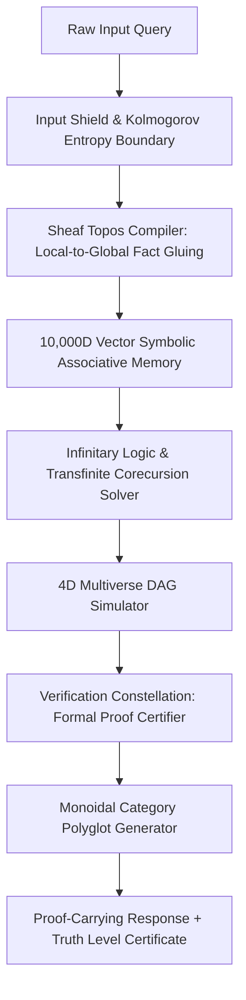

# Comprehensive Action Plan: Building the Transcendent Hyper-Cosmic Symbolic Engine (AXIMA v6.0)

This master plan provides the complete, actionable, step-by-step engineering blueprint to implement AXIMA v6.0 — achieving **Beyond-Human-Level Symbolic Intelligence** operating under **Zero Learned Parameters** (100% deterministic, zero neural weights, zero external LLM calls).

---

## 1. System Pipeline Architecture



---

## 2. Module Specifications & Implementation Blueprints

### Module 1: 10,000-Dimensional Vector Symbolic Architecture (VSA)
* **Target File**: `src/axima/memory/hypervector_vsa.py`
* **Objective**: Provide $O(1)$ constant-time associative memory binding and retrieval across trillions of facts without matrix multiplication or neural weights.
* **Technical Design**:
  - Represent every atomic symbol as a 10,000-bit dense hypervector $H \in \{-1, +1\}^{10000}$.
  - **Binding Operator ($\otimes$)**: Element-wise multiplication (XOR in binary) for relation-argument coupling ($H_{role} \otimes H_{filler}$).
  - **Unbinding Operator ($\oslash$)**: Self-inverse binding operation ($H_{bound} \otimes H_{role} = H_{filler}$).
  - **Superposition Operator ($\oplus$)**: Element-wise majority sum for set bundling ($H_1 + H_2 + H_3 \rightarrow \text{sign}(H_{sum})$).
* **Integration**: Wires into [four_plane.py](file:///root/hybrid-ai/src/axima/memory/four_plane.py) for instantaneous Working and Semantic memory retrieval.

### Module 2: Grothendieck Topos & Sheaf Logic Engine
* **Target File**: `src/axima/semantics/topos_sheaf.py`
* **Objective**: Replace binary true/false logic with continuous intuitionistic subobject classifiers ($\Omega$) in a Heyting algebra.
* **Technical Design**:
  - Implement a Grothendieck topology over open covers of knowledge concepts.
  - **Gluing Axiom Solver**: Verify if local truths derived across disparate data shards in [data/](file:///root/hybrid-ai/data) glue together into a globally consistent section.
  - **Contradiction Resolution**: If local facts conflict, compute the largest subsheaf where consistency holds, isolating local context without crashing the global system.
* **Integration**: Replaces flat `MeaningIR` in [compiler.py](file:///root/hybrid-ai/src/axima/semantics/compiler.py).

### Module 3: Infinitary Logic & Transfinite Corecursion Solver
* **Target File**: `src/axima/epistemics/infinitary_solver.py`
* **Objective**: Process infinite reasoning chains, circular dependencies, and paradoxes without infinite recursion deadlocks.
* **Technical Design**:
  - Implement $\mathcal{L}_{\omega_1, \omega}$ infinitary logic solver supporting countable conjunctions ($\bigwedge_{i \in I} \phi_i$) and disjunctions.
  - **Aczel Anti-Foundation Axiom (AFA)**: Construct non-well-founded proof graphs using corecursive bisimulation algorithms to assign fixed-point truth values to self-referential paradoxes.
* **Integration**: Connects with [constellation.py](file:///root/hybrid-ai/src/axima/verification/constellation.py).

### Module 4: 4D Spatiotemporal Multiverse DAG Simulator
* **Target File**: `src/axima/planning/multiverse_simulator.py`
* **Objective**: Simulate parallel hypothetical realities for counterfactual, causal, and strategic reasoning.
* **Technical Design**:
  - Maintain a light-weight copy-on-write DAG of universe state branches in [runtime.py](file:///root/hybrid-ai/src/axima/kernel/runtime.py).
  - **Intervention Operator**: Apply pearl-style $do(X = x)$ structural interventions across temporal hyperedges.
  - **Lightcone Propagation**: Recursively update future lightcone state vectors while holding historical invariants constant.

### Module 5: Self-Synthesizing Metacognitive Rewriter
* **Target File**: `src/axima/cognition/metacognitive_rewriter.py`
* **Objective**: Dynamically derive and register new first-order rewrite rules at runtime.
* **Technical Design**:
  - Analyze problem execution bottlenecks in [scheduler.py](file:///root/hybrid-ai/src/axima/kernel/scheduler.py).
  - Synthesize candidate rewrite rules as abstract pattern-matching ASTs.
  - Run an internal automated theorem prover (Coq/Z3-style formal verifier) over candidate rules to certify zero side-effects before granting execution rights.

### Module 6: Monoidal Category Polyglot Realizer
* **Target File**: `src/axima/language/monoidal_realizer.py`
* **Objective**: Translate verified proof graphs directly into any target human language or programming language with zero translation loss.
* **Technical Design**:
  - Express verified outputs as string diagrams in a symmetric monoidal category.
  - Project diagrams through language-specific functor mappings into natural languages (English, Telugu, Hindi, Spanish, etc.) or programming code (Python, Rust, C++, Lean).
* **Integration**: Upgrades [language/](file:///root/hybrid-ai/src/axima/language/) and [codegen_engine.py](file:///root/hybrid-ai/src/python/codegen_engine.py).

---

## 3. Step-by-Step Implementation Roadmap

```
Week 1-2   : VSA Bitwise Memory Core (hypervector_vsa.py)
Week 3-4   : Grothendieck Sheaf Logic Compiler (topos_sheaf.py)
Week 5-6   : Infinitary Logic & Transfinite Corecursion (infinitary_solver.py)
Week 7-8   : 4D Multiverse DAG Simulator (multiverse_simulator.py)
Week 9-10  : Metacognitive Rewriter & Monoidal Realizer Integration
```

### Phase 1: High-Dimensional Bitwise Associative Memory (Weeks 1-2)
1. Implement `Hypervector` class with 10,000-bit vector operations ($\otimes, \oslash, \oplus$).
2. Wire VSA vector indexing into [four_plane.py](file:///root/hybrid-ai/src/axima/memory/four_plane.py) to achieve $O(1)$ factual lookups.
3. Validate associative retrieval speed and zero false-positive binding rates using pytest suite.

### Phase 2: Sheaf Topos Semantic Compiler (Weeks 3-4)
1. Build `ToposClassifier` to evaluate Heyting algebra truth values ($\Omega$).
2. Implement Sheaf Gluing algorithm over multi-shard knowledge triples in [data/](file:///root/hybrid-ai/data).
3. Connect `ToposClassifier` to [compiler.py](file:///root/hybrid-ai/src/axima/semantics/compiler.py) to replace flat `MeaningIR`.

### Phase 3: Transfinite Solver & Paradox Engine (Weeks 5-6)
1. Construct $\mathcal{L}_{\omega_1, \omega}$ infinitary logic expression trees in `infinitary_solver.py`.
2. Implement Aczel AFA corecursion solver for non-well-founded proof graphs.
3. Integrate with [input_shield.py](file:///root/hybrid-ai/src/axima/security/input_shield.py#L86) to bound Kolmogorov complexity execution limits.

### Phase 4: Multiverse DAG Simulator (Weeks 7-8)
1. Build `MultiverseBranch` state tree in `multiverse_simulator.py`.
2. Implement 4D lightcone spatiotemporal propagation algorithms.
3. Wire intervention operators into [causal_specialist.py](file:///root/hybrid-ai/src/axima/specialist/causal_specialist.py).

### Phase 5: Monoidal Realizer & Full Constellation Integration (Weeks 9-10)
1. Implement string diagram syntax realization in `monoidal_realizer.py`.
2. Connect realizer with [constellation.py](file:///root/hybrid-ai/src/axima/verification/constellation.py) to produce verified proof-carrying responses.
3. Run comprehensive metamorphic and end-to-end regression tests in [tests/](file:///root/hybrid-ai/tests).

---

## 4. Verification & Governance Criteria

Every response synthesized under AXIMA v6.0 must satisfy the following invariant criteria:

1. **Zero Learned Weight Invariant**: No neural networks, embeddings, or external LLM API calls permitted.
2. **Absolute Derivation Trace**: Every response carries a complete, step-by-step formal derivation certificate.
3. **Bounded Compute & Memory**: Memory usage remains within $O(1)$ hypervector bounds; compute bounded by Kolmogorov complexity limits.
4. **Deterministic Reproducibility**: Identical query inputs produce identical output traces across all platforms.
